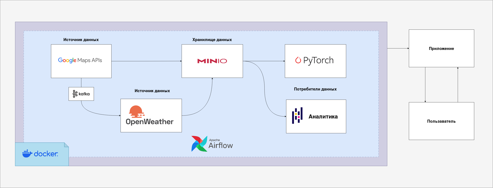
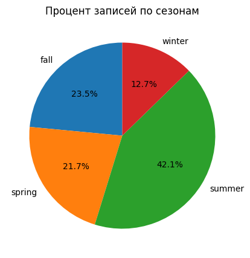

# Определение сезона по фотографии и гео-данным

### Введение

-----

***Задача выполнена студентами СПбГУ Б04-ПУ в рамках курса по теоретической информатике***

_**Разработчики проекта:**_
* Степков Дмитрий
* Кузьмин Егор
* Шехаде Даниил

-----

На вход модели идет фотография, температура, город (координаты lat lon), высота над уровнем моря, и нужно определить сезон: весна, лето, осень, зима. усложнение: определить месяц.

В данном проекте реализована полная архитектура процесса решения задачи машинного обучения: от сбора данных, их аналитики и обработки до применения готовых данных для обучения модели и развертки интерфейса для взаимодействия с ней.

### Инструменты и архитектура

* **Инструменты используемые для сбора и хранения данных**
  + Docker - Запуск процессов в контейнерах для изоляции и воспроизводимости функционала.
  + [Google Static StreetView API](https://developers.google.com/maps/documentation/streetview/overview) - Источник данных (фотографии, дата съёмки)
  + [Open Meteo historical weather API](https://open-meteo.com/en/docs/historical-weather-api) - Источник данных (температура, геоданные)
  + Apache Airflow - Оркестрация процессов сбора, загрузки, анализа данных
  + MINIO - Объектное хранилище

----

___- Почему не ограничиться выгрузкой из апи в локальное хранилище?___ 

\- Можно было бы действительно остановиться на этом, 
но у такого подхода есть свои несомненные плюсы:
1) Скорость загрузки намного выше при использовании докер + минио, объясняется это изолированностью процессов внутри контейнеров, так же апи отправляет фото в виде бинарного файла, то есть, чтобы записать его в системе, требуется сначала декодировать его, потом записать в систему и только полсе этих шагов мы можем перейти к следующему запросу. Минио эту проблему решает, декодируя изображения в отдельном контейнере
2) Автоматизация - мне не приходится каждый час перезапускать скрипт после достижения лимита запросов, за меня это делает Airflow, так же он собирает аналитику по данным при увеличении их количества
3) Масштабируемость и воспроизводимость - эта архитектура может быть применена в других проектах, дополнена для решения более трудных задач

___- Какие проблемы есть в данных? какие решения были предприняты для их решения?___

\- Сбор подобных данных является достаточно проблематичным 
для индивидуального проекта. Требование привязки фотографии к координатам,
а так же разметка фотграфий по сезонам / месяцам накладывает ограничение на ресурсы поиска.
Решением стал гугл апи, который является условно бесплатным, потому что предоставляет бесплатный доступ на 
ограниченный срок при добавлении платежного метода.

\- Качество данных так же ограниченно: в собранных данных присутствует 
дисбаланс; не представляется возможным обучения модели 
на ночных фотографиях, потому что в выборке их крайне мало. Решение этих проблем пока не было придумано.

----  

