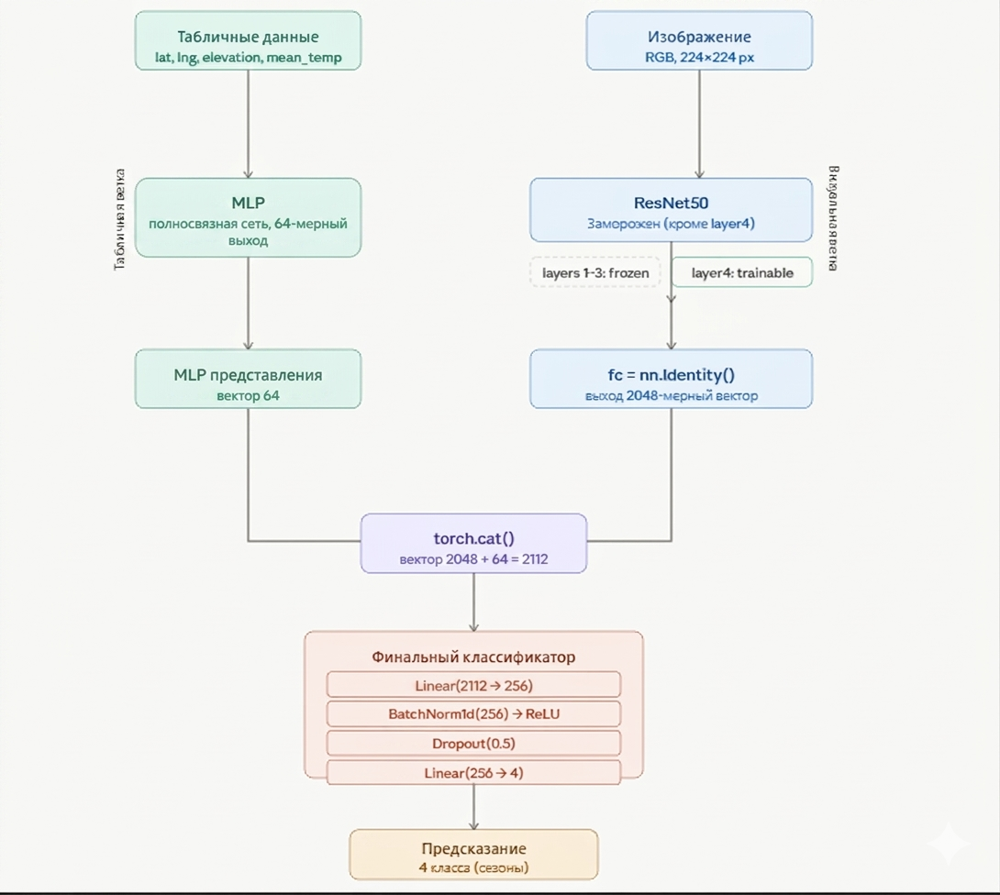

# Определение сезона по фотографии и гео-данным

### Введение

На вход модели идет фотография, температура, город
(координаты в формате (долгота, широта)), высота над уровнем моря, 
и нужно определить сезон: весна, лето, осень, зима.
Усложнением задачи может служить задача определения месяца.

В данном проекте реализована полная архитектура процесса решения задачи машинного обучения: от сбора данных, их аналитики и обработки до применения готовых данных для обучения модели и развертки интерфейса для взаимодействия с ней.

### Инструменты и архитектура


* **Инструменты используемые для сбора и хранения данных**
  + Docker - Запуск процессов в контейнерах для изоляции и воспроизводимости функционала.
  + [Google Static StreetView API](https://developers.google.com/maps/documentation/streetview/overview) - Источник данных (фотографии, дата съёмки)
  + [Open Meteo historical weather API](https://open-meteo.com/en/docs/historical-weather-api) - Источник данных (температура, геоданные)
  + Apache Airflow - Оркестрация процессов сбора, загрузки, анализа данных
  + MINIO - Объектное хранилище
  + Kafka - Брокер сообщений

----
#### Вопросы
___- Какие проблемы есть в данных? какие решения были предприняты для их решения?___

\- Сбор подобных данных является достаточно проблематичным 
для индивидуального проекта. Требование привязки фотографии к координатам,
а так же разметка фотграфий по сезонам / месяцам накладывает ограничение на ресурсы поиска.
Решением стал гугл апи, который является условно бесплатным, потому что предоставляет бесплатный доступ на 
ограниченный срок при добавлении платежного метода.

\- Качество данных так же ограниченно: в собранных данных присутствует 
дисбаланс, не представляется возможным обучение модели 
на ночных фотографиях, потому что в выборке их крайне мало, присутствуют фото внутри помещений.
Для   реализации данного проекта было собрано ~24000 тысячи фотографий с метаданными
по локации их съёмки.

---


-------  

### Архитектура модели 

----


**ResNet50** - глубокая сверточная нейронная сеть (CNN), состоящая из 50 слоев. 
Используем её для получения эмбединга фотографии.

Изменения:
- Разморозка предпоследнего слоя
- Изменение последнего слоя на тождественный

**MLP** - Используем для предсказания по табличным данным. В ходе работы мы
использовали разные параметры для MLP, наилучший результат дали следующие парметры:
```
self.tableNN = nn.Sequential
        (
            nn.Linear(4, 16),
            nn.BatchNorm1d(16),
            nn.ReLU(),
            nn.Linear(16, 32),
            nn.ReLU()
        )
```

**CatBoost** - Тестрировали в качестве замены для MLP, даёт 
лучший результат при дисбалансе данных, который характерен собранным данным.

### Полученные результаты

Текущая модель имеет точность равную 75%, 
ошибаясь при этом по большей части на зимних и весенних фотографиях, модель включающая 
в себя CatBoost вместо MLP, напортив же, имеет высокую точность на зиме и весне,
но точность близкую к ~60% на лете и осени. Это можно использовать для совместной 
работы моделей, отдавая предпочтение различным предсказаниям в случае разных сезонов.

$$]\quad(x_1,x_2, x_3,x_4),\quad (y_1,y_2,y_3,y_4)$$

-- проценты уверенности в каждом сезоне модели с MLP и модели с CatBoost 
соответственно (1 - зима, 2 - весна, 3 - лето, 4 - осень). Будем отдавать 
больший приоритет $y_1$ , $y_2$ , $x_3$ , $x_4$ при предсказании.

Так же в качестве улучшение модели можно рассмотреть использование других сетей
, к примеру CLIP, при этом генерировать синтетическое описание для фотографии, 
которое будет выделять фичи важные для понимания различий между сезонами
(листья на деревьях, удалённость солнца, снег и подобные фичи). Такой подход кажется наиболее
предпочтительным, т.к. он даёт нейросети данные, которые человек
выделяет сразу при виде фотографии.

Для дальнейшего развития модели требуется больше данных и вычислительных мощностей.
